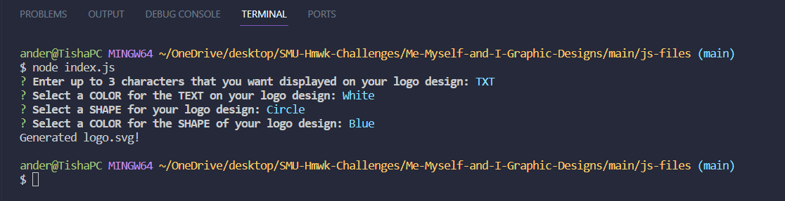
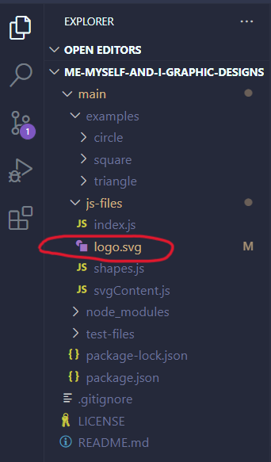
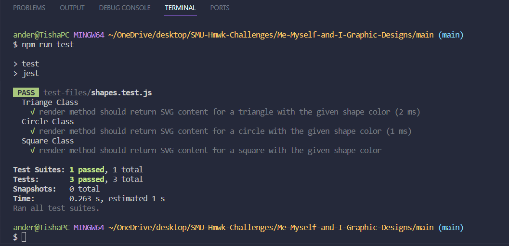
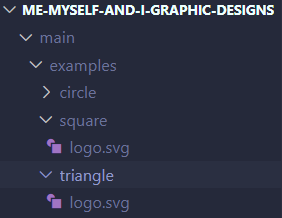

# Me-Myself-and-I-Graphics (Challenge #10)

## Table of Contents

- [Description](#description)
- [Installation](#installation)
- [Usage](#usage)
- [Test Sample](#test-sample)
- [Credits](#credits)
- [Contributing](#contributing)
- [License](#license)

## Description

As a freelance web developer, my goal was to create a simple logo generator for my projects. This way I can make the logos myself and avoid having to pay a graphic designer.

This is possible using a Node.js command-line application that takes in user input to generate a logo and save it as an [SVG file](https://en.wikipedia.org/wiki/SVG). The application prompts the user to select a color and shape, provide text for the logo, and save the generated SVG to a `.svg` file.


## Installation

The application will use [Jest](https://www.npmjs.com/package/jest) for running the unit tests and [Inquirer](https://www.npmjs.com/package/inquirer/v/8.2.4) for collecting input from the user. The application will be invoked by using the following command:

``````
node index.js
``````

## Usage

The application will include `Triangle`, `Circle`, and `Square` classes, as well as tests for each of these classes using Jest. Any common functionality and properties shared by the `Triangle`, `Circle`, and `Square` classes will be placed in a parent `Shape` class and the inheritance method will reuse the code in the child classes.

Each shape will then be tested using the `render()` method that returns a string for the corresponding SVG file with the given shape color.

Once setup, answer the following prompt questions regarding your logo:



Once all questions are answered, you will see `Generated logo.svg!` populate at the bottom of the terminal (as seen above).

Your newly designed logo will populate in your project folders:



I verified that my app works properly by running tests for each shape (Triangle, Circle, and Square) using the `render()` method ensuring it returned a string for the corresponding SVG file with the given shape color. When I ran `npm run test` in the terminal, all 3 tests passed:



I have included examples of each shape for the logo designs if you'd like to reference them before creating your new logo.



## Test Sample

Watch the video of my test logo here:


### Credits

[MDN WEB DOCS SVG: Scalable Vector Graphics](https://developer.mozilla.org/en-US/docs/Web/SVG)

[Example SVG](https://static.fullstack-bootcamp.com/fullstack-ground/module-10/circle.svg)

[Class Constructors and Inheritance](https://developer.mozilla.org/en-US/docs/Web/JavaScript/Reference/Classes#inheritance)

[JEST](https://jestjs.io/docs/getting-started)

### License

[](https://opensource.org/licenses/MIT)